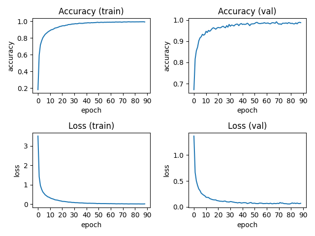
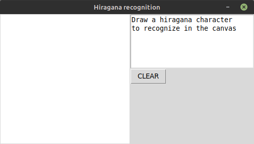
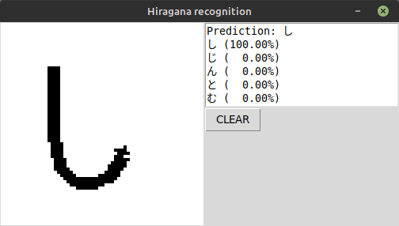
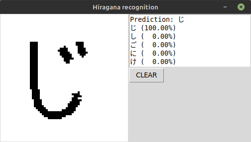

# Hiragana recognition

Handwritten hiragana recognition software.

## Obtaining the ETL Character Database

To download **ETL Character Database**, you need to accept `Conditions of Use` and fill the `Registration Form` at [etlcdb.db.aist.go.jp](http://etlcdb.db.aist.go.jp).

## Obtaining unpack.zip

To download `unpack.zip`, go to [http://etlcdb.db.aist.go.jp/file-formats-and-sample-unpacking-code](http://etlcdb.db.aist.go.jp/file-formats-and-sample-unpacking-code).

## Extracting hiragana dataset

- Clone this repository
- Download **ETL Character Database** and unzip into ETL directory
- Download `unpack.zip` and unzip into repository root folder
- Run `create_dataset.sh` script consisting of:
    - Virtual python environment creation and setup
    - **ETL Character Database** extraction
    - Hiragana dataset extraction
    - Minor samples cleanup
    - Samples size unification
    - Small characters removal

## Classifier

Run `train_hiragana_conv.sh` to train your own CNN classifier, or use `model.h5`.  
This model has 99.15% accuracy. Learning curves are shown below.

## Character recognition

Run `recognize.sh` to launch the program.  
To draw on canvas, hold left mouse button. To clear canvas, use `CLEAR` button.

## Images

